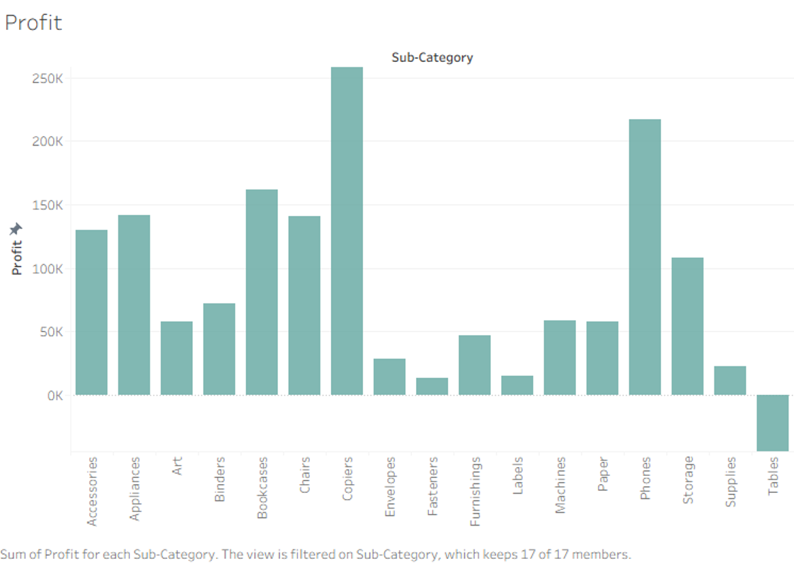
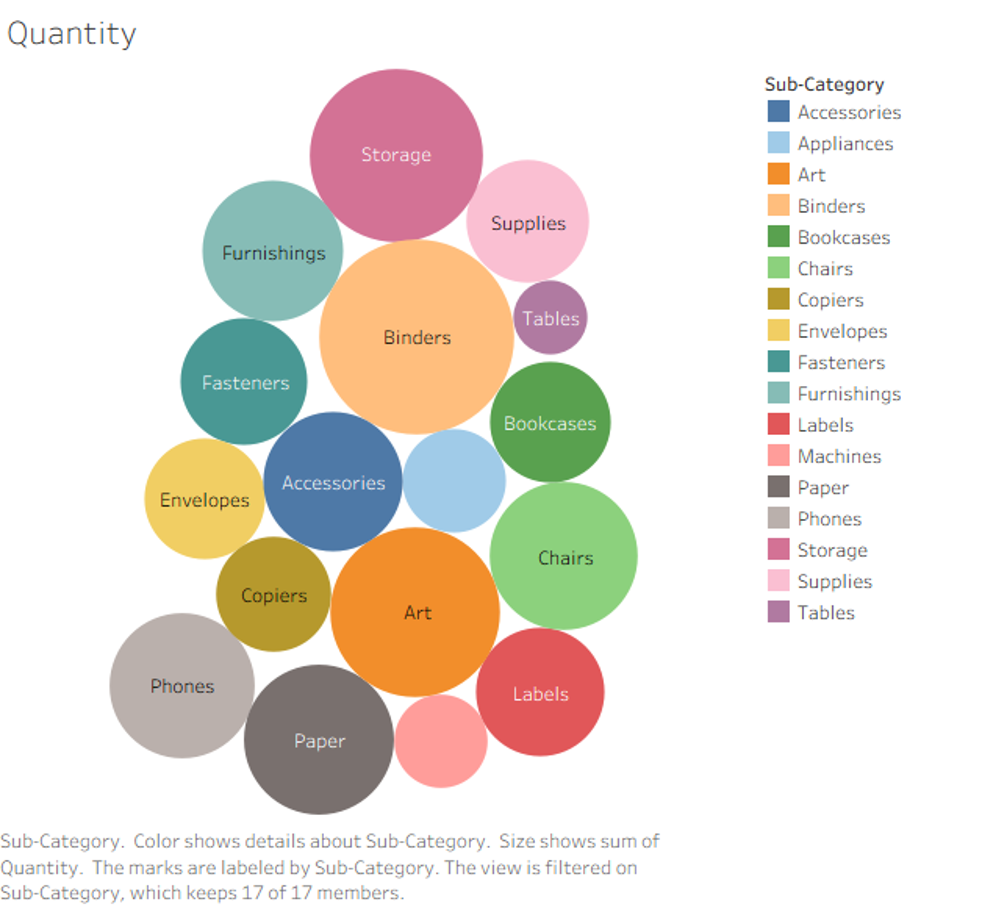
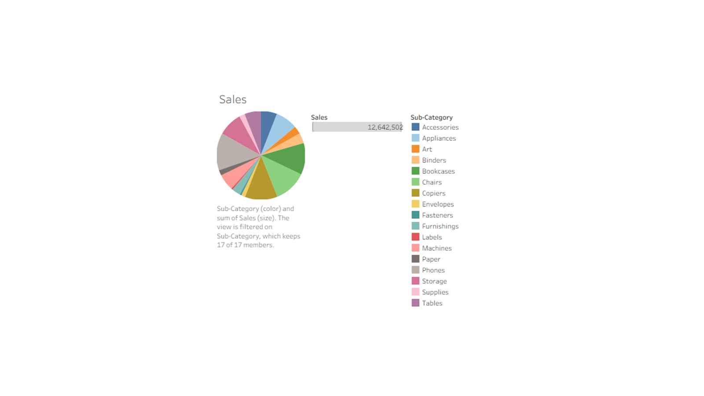
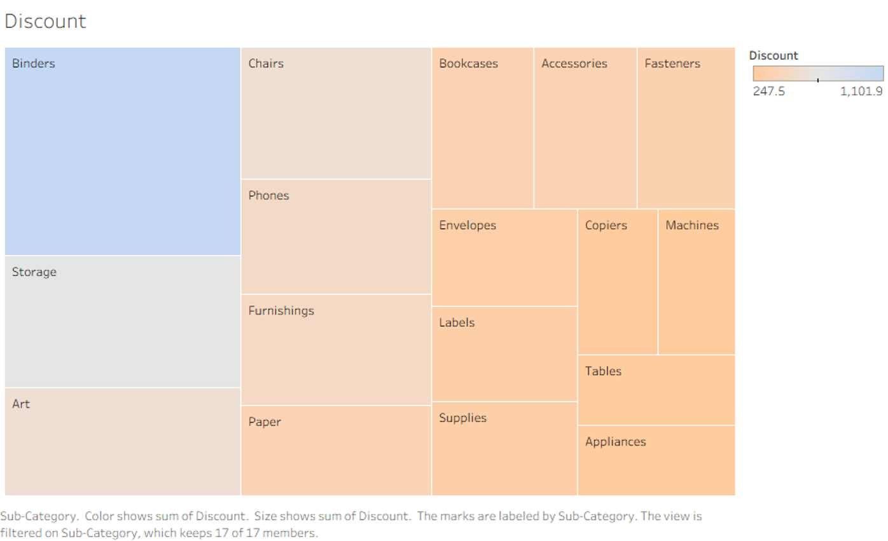
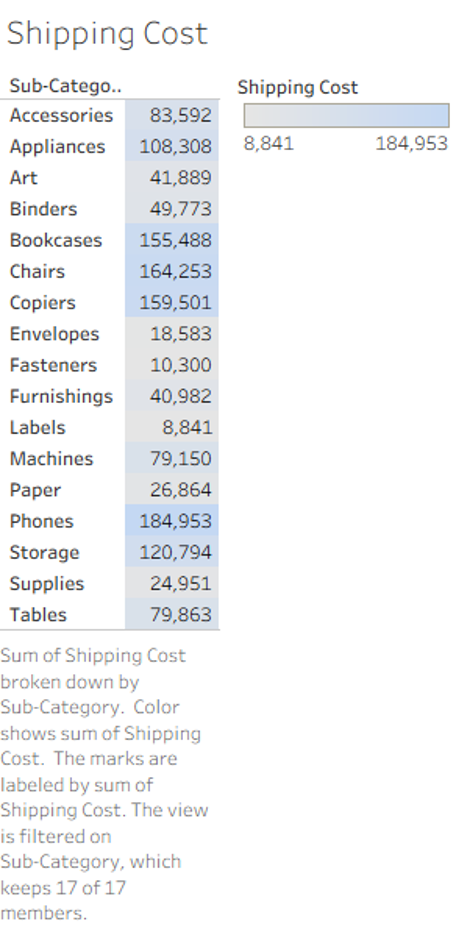

# From Volume to Value: Global Superstore Sub-Category Performance
A Tableau portfolio project that compares **sales, profit, quantity, accumulated discount, and shipping cost** across Global Superstore product sub-categories.

The project asks a management question that is more useful than simply “Which category sells the most?”:

> **Which sub-categories create economic value, which depend on volume or discounting, and which destroy value despite generating sales?**

> **Interactive version:** Add the Tableau Public URL here after publishing the workbook.

## Business narrative
The five views describe different parts of the same commercial story:

1. **Copiers are the strongest profit creator**, while Tables are the only clearly loss-making sub-category.
2. **Phones lead sales and shipping cost**, showing that revenue leadership can also create a substantial cost-to-serve burden.
3. **Binders dominate quantity and accumulated discount**, suggesting a volume-led business model rather than a premium-margin model.
4. **High volume, high sales, and high profit are not the same thing.** Each measure identifies a different type of product performance.
5. A management dashboard should therefore evaluate sub-categories through a balanced lens: **revenue, profit, discount exposure, volume, and logistics cost**.

## Key findings
| Finding | Management interpretation |
|---|---|
| **Copiers generate approximately $258.6K profit**, the highest among the sub-categories. | Copiers appear to convert sales into profit efficiently and should be protected as a high-value line. |
| **Phones generate approximately $1.71M sales** and the highest shipping cost at about **$185.0K**. | Phones are a scale leader, but management should monitor fulfillment economics and cost-to-serve. |
| **Tables generate approximately -$64.1K profit.** | Tables require a pricing, discount, sourcing, or logistics review because sales are not translating into value. |
| **Binders have the largest quantity bubble and the highest accumulated discount.** | Binders appear volume-driven; their profitability should be assessed separately from their unit volume. |
| Shipping cost varies substantially across sub-categories. | Product performance should be assessed after considering operational costs, not only gross sales. |

## Tableau views

### 1. Profit by sub-category
Copiers and Phones are major profit contributors, while Tables fall below zero. This is the clearest evidence that revenue and value creation are not identical.

### 2. Quantity by sub-category
The packed-bubble chart highlights unit-volume concentration. Binders form the largest bubble, while Paper, Storage, Art, Chairs, and Phones also carry substantial volume.

### 3. Sales by sub-category
The sales view shows the distribution of total revenue across the 17 sub-categories. Phones are the sales leader, but the profit view shows that the most profitable category is different.

### 4. Accumulated discount by sub-category
Binders have the largest accumulated discount exposure. This should be interpreted together with quantity, because a high sum can partly reflect a large number of transactions.

### 5. Shipping cost by sub-category
Phones have the highest shipping cost, followed by Chairs, Copiers, and Bookcases. This provides an operational counterweight to the sales analysis.

## Management takeaway
This project reveals four distinct performance patterns:

- **Value leader:** Copiers
- **Revenue and logistics scale leader:** Phones
- **Volume and discount leader:** Binders
- **Value-destruction risk:** Tables

The practical lesson is that managers should not rank product lines using sales alone. A balanced product scorecard should combine:
- Sales
- Profit
- Profit margin
- Quantity
- Average discount
- Shipping cost ratio
